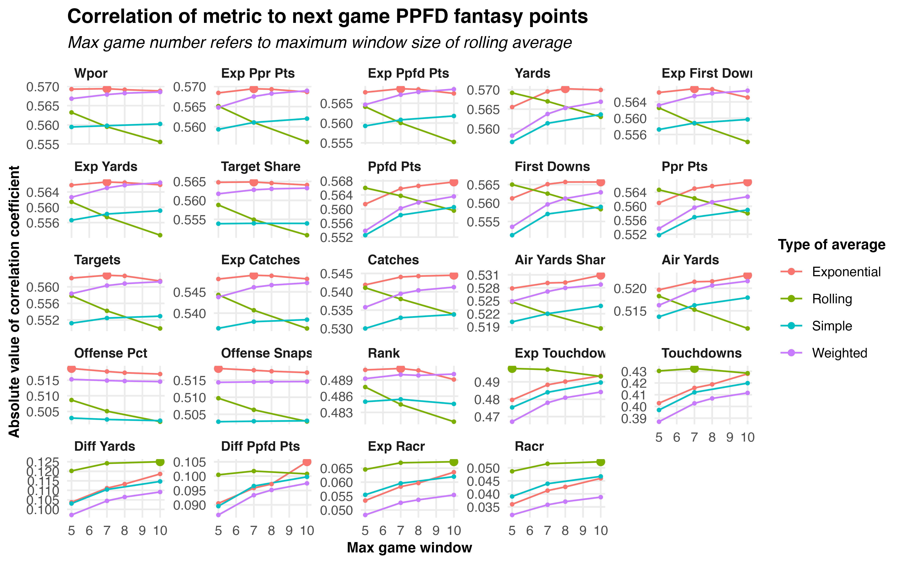
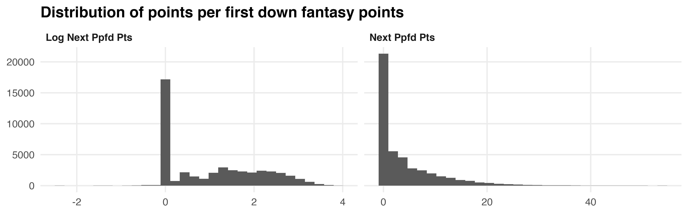
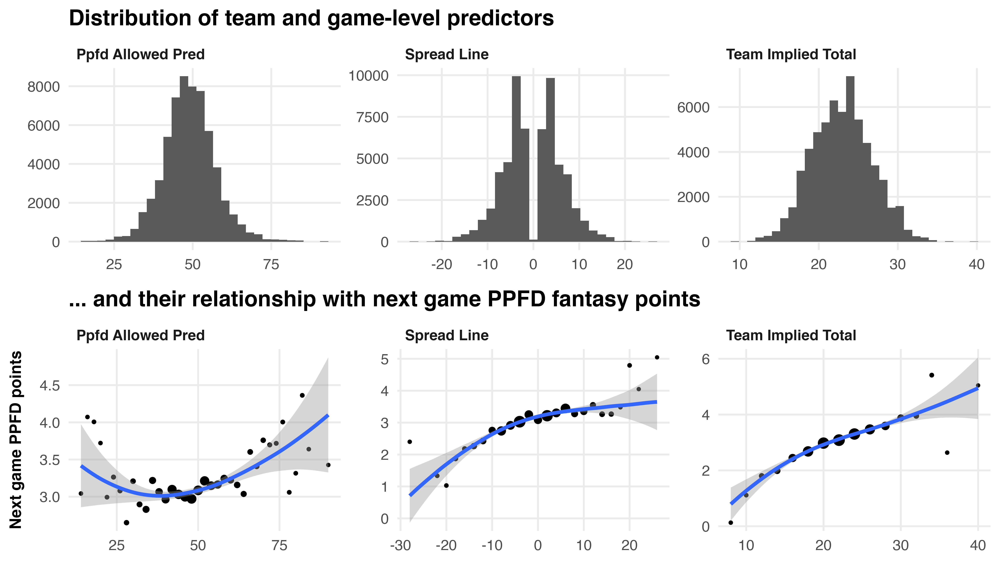
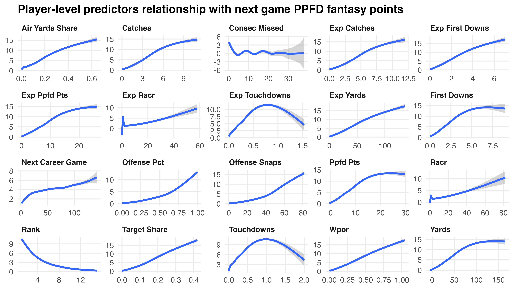
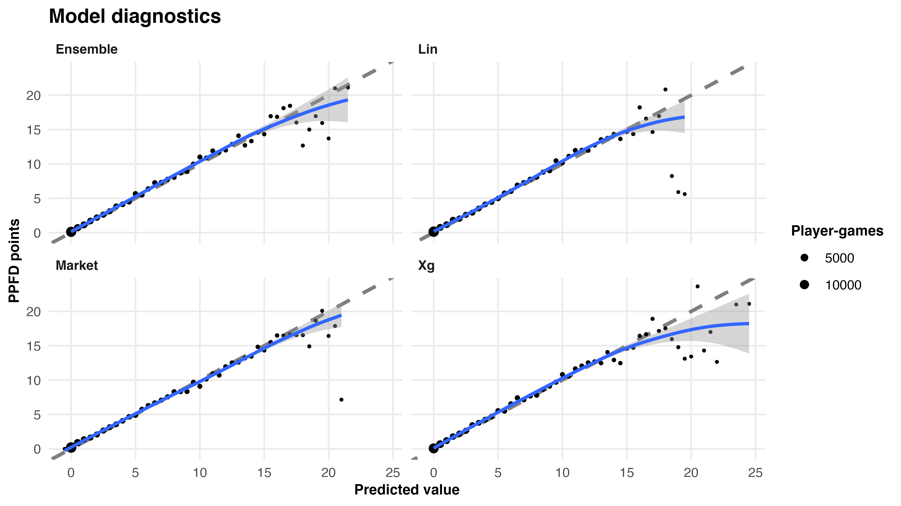
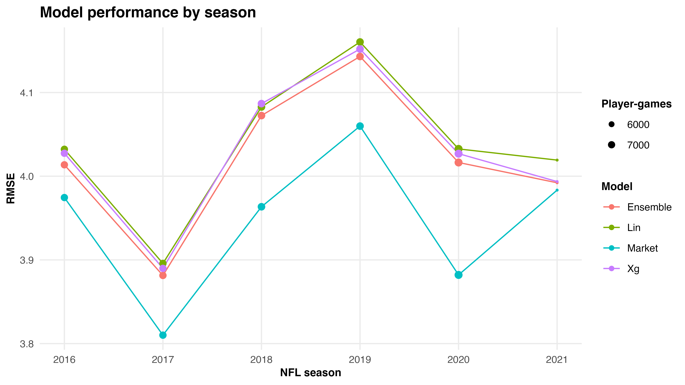
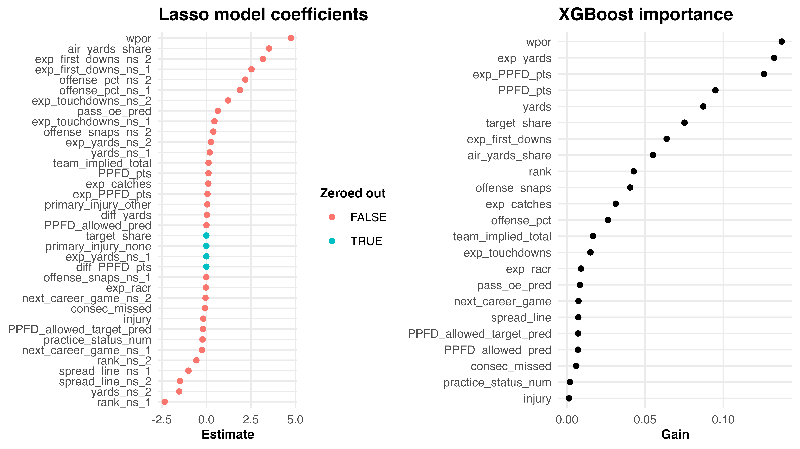
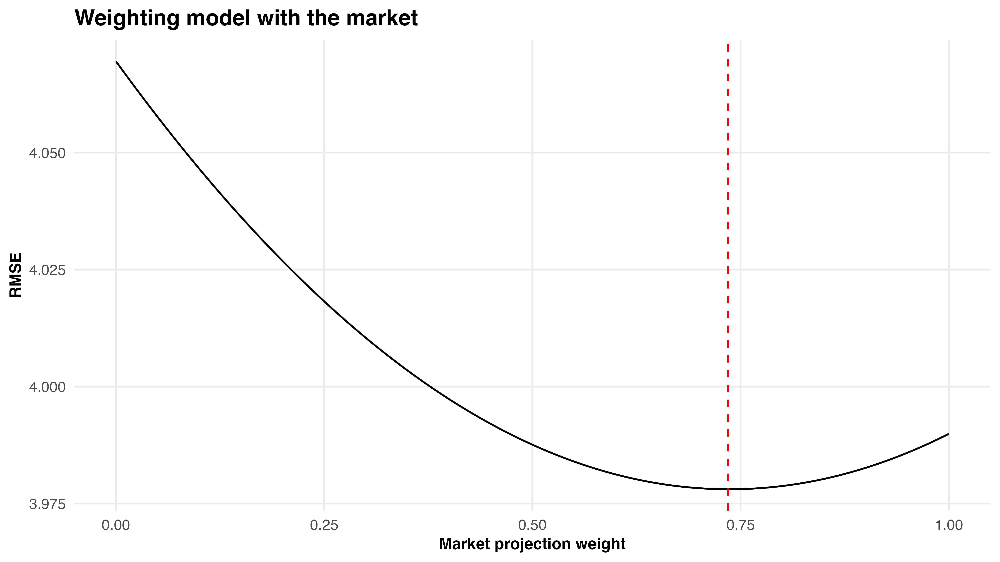

```{r setup, include=FALSE}
knitr::opts_chunk$set(warning = FALSE, message = FALSE, 
                      echo = TRUE, dpi = 300, cache.lazy = FALSE,
                      tidy = "styler", fig.width = 8, fig.height = 5)
```

## Introduction

Fantasy football has become an increasingly more popular way to consume and enjoy the National Football League (NFL). There are a variety of ways to play, from standard scoring to point-per-reception scoring to individual defensive player leagues. Each type of rule system brings about a slightly different strategy in terms of which players to play and roster each week. An alternative way to play is to use point-per-first-down scoring, which rewards players a point for each first down they gain during a game. Unfortunately, this is a unique and less popular way to play, meaning companies (ESPN, Yahoo, etc.) do not release weekly rankings/projections for this type of scoring system. As such, the goal of this project is to forecast weekly receiving point-per-first-down scoring. Ideally, we attempt to out-perform market expectations as measured by root mean squared error. NOTE: we do not consider rushing or passing in this project.

If unfamiliar with the NFL or fantasy football, the project simply aims to model an individual player's point-per-first-down fantasy points scored in their next game based on their previous statistics. Fantasy points are scored as a function of the yards gained, first downs gained, and touchdowns scored for that player. Specifically, each yard gained is 0.1 points (i.e., 78 receiving yards = 7.8 points). Each touchdown is worth 6 points and each first down is worth 1 point (note that a touchdown also counts as a first down - so technically 7 points).

As one might expect, many of the performance statistics of a receiver in relation to fantasy points scored are correlated with one another. For example, the number of yards a player gains is correlated with the number of catches they make. This project will have to carefully consider such multi-collinearities among the predictors of a player's next game fantasy point output. 

Much of the data is pulled from the `nflreadR` package, but additional web-scraping is performed. NOTE: there are a variety of privately charted statistics that can better predict fantasy football scoring that we do not have access to publicly. A large bulk of the project involves intense data cleaning, wrangling, and feature engineering. All code can be found on my GitHub [here](https://github.com/JackLich10/ppfd_ff). 

We attempt two different model specifications as well as an ensemble between the two in an effort to predict weekly receiving point-per-first-down scoring. A side effect of our predictive modeling is still a relatively interpretable framework of fantasy football scoring.

Project goals are clearly stated, with relevant
issues and challenges clearly identified
• Project analysis, results, and conclusions fully
address the above goals. Strengths and limitations
of the analysis & data should be clearly presented.
• Project importance and relevance clearly
communicated, esp. to a person not in the field.


## Data

The data for this project is primarily gathered from the excellent `nflreadR` package. The package is an easy to use wrapper primarily for `nflfastR`, which is a package that scrapes NFL play-by-play data. These packages allow us to easily retrieve not only this granular play-by-play data, but also team schedules, mappings of player IDs across many sources, etc.. While the package provides a very robust dataset, we must also scrape other internet sources for vital information. Using the `ffpros` package, we scrape historical NFL fantasy football weekly projections (code for this provided in `R/market.R`). Additionally, we scrape pro-football-reference.com for an alternative injury data source (code for this provided in `R/pfr_injuries.R`). From www.nfl.info/dataexchange, we scrape active roster data by week (code for this provided in `R/actives.R`).

The data cleaning/wrangling/feature engineering can all be found primarily in the `R/load_data.R` script. The script creates our `model_dataset` object. The keys of the data are `next_game_id`, `player_id` (one row per player per game). As of week 13 of the 2021 NFL season, we have a dataset of 61,056 rows (i.e., player-games) dating back to the 2013 NFL season. Below, we lay out the data dictionary of the variables in this dataset:

*All variables come via data wrangling of `nflreadR` unless specified.

#### Identification variables:

- `(prev)(next)_game_id`: The previous/next game ID the player is involved in
- `(prev)(next)_season`: The previous/next season of the game the player is involved in
- `(prev)(next)_week`: The previous/next week of the game the player is involved in
- `current`: Whether or not the next game is the most current season-week of the NFL season
- `player_id`: Unique ID of the player
- `team`: NFL team player plays for

#### Predictors:

Variables with the `exp_` prefix denote variables that utilize `nflfastR`'s underlying completion percentage model. That is, instead of taking the raw value, we multiply the outcome by how likely the pass is to be caught (i.e., `exp_catches` is the sum of completion probability for each target; example: player is targeted twice with completion probabilities of 60% and 55%, this equates to 0.6+0.55=1.15 `exp_catches`). These variables are an attempt to account for highly variable outcomes by regressing a player's statistics toward league average. Code for these calculations can be found on lines 337-375 of `R/load_data.R`.

(*) Denotes variable that is a lagged moving-window average of previous games

- `targets`: Number of times player is targeted (*)
- `target_share`: `targets` divided by total number of team targets (*)
- `rank`: Rank of `target_share` within the player's team for that season-week
- `air_yards`: Cumulative number of yards down the field a player is targeted (i.e., a player is targeted 11 yards down field = 11 air yards) (*)
- `air_yards_share`: `air_yards` divided by total number of team air yards (*)
- `wpor`: 1.5 x `target_share` + 0.7 x `air_yards_share` (*)
- `(exp_)catches`: Number of receptions for the player (*)
- `(exp_)yards`: Number of yards gained for the player (*)
- `(exp_)first_downs`: Number of first downs gained for the player (*)
- `(exp_)touchdowns`: Number of touchdowns scored for the player (*)
- `(exp_)PPFD_pts`: Number of point-per-first-down fantasy points scored for the player (*)
- `(exp_)racr`: `(exp_)yards` divided by `air_yards` (*)
- `diff_yards`: `yards` - `exp_yards` (*)
- `diff_PPFD_pts`: `PPFD_pts` - `exp_PPFD_pts` (*)
- `offense_snaps`: Number of offensive snaps played (*)
- `offense_pct`: `offense_snaps` divided by total offensive snaps of team (*)
- `consec_missed`: Consecutive games the player missed leading up to the `next_game_id`
- `report_status`: One of 'Out', 'Doubtful', 'Questionable', 'Probable', NA (meaning healthy), denoting a player's status for the upcoming game
- `practice_status`: One of 'DNP' (did not practice), 'Limited', 'Full', NA (meaning healthy), denoting a player's status during the week of the upcoming game
- `primary_injury`: Body part of injury for player
- `active`: Binary indicator denoting if a player was on the active roster for `next_game_id` (via www.nfl.info/dataexchange)
- `type`: Injury type (via Pro Football Reference)
- `team_implied_total`: Vegas (betting market) implied team total points
- `spread_line`: Vegas (betting market) spread
- `PPFD_allowed_pred`: Number of fantasy points allowed by the defense the player is playing in the next week (*)

#### Response/outcome variables:

- `dnp`: Binary indicator denoting if a player played in `next_game_id` (via Pro Football Reference)
- `no_play`: Binary indicator denoting if a player accumulated stats in `next_game_id`
- `next_PPFD_pts`: Point per first down receiving fantasy points in `next_game_id` (target variable)

• Data sources are clearly outlined & fully
described. If needed, a clear procedure is given on
how to get from raw data to usable data.
• All variables (predictors and response) clearly
identified and described for the study. Any relevant
properties of these variables (e.g., for modeling,
interpretation) should be fully discussed.
• The conclusions obtained from the proposed data
can fully address project goals. If not, potential
limitations in the data should be fully discussed.
• Multiple data sources are used to address project
goals in a comprehensive and nuanced way.
• Handling of missing data (if present) is discussed
• Exploratory data analysis (EDA) should support
project goals and help guide model selection


## Feature Engineering

As denoted with a (*) in the 'Data' section, the feature engineering process involved taking lagged moving-window averages of previous game player statistics and performance in order to predict their next game performance. A variety of types of moving averages were tried. Specifically, we create separate datasets with exponential, rolling, weighted, and simple rolling averages of each predictor. Additionally, instead of simply converting each statistic into a moving average of the last $X$ games, we will convert each statistic into a moving average using a dynamic window that ranges from five games to $X$ games (where we alter $X$ from 5-10). In other words, we will use a five game window to predict a player's fantasy point production in their sixth game, but for say the 15th game, we will use an $X$ game window. The baseline of five games was chosen somewhat arbitrarily, as a number that seems like a reasonably large enough sample size to reduce noise and reasonably small enough to account for the inherent non-stationarity of the NFL. 

Below, we observe the Pearson correlation coefficient between each predictor's lagged moving-window average and a player's next game fantasy performance. The metrics are ordered by their correlation to `next_PPFD_pts` (`wpor` = best, `racr` = worst). The largest sized point in each facet denotes the highest correlation coefficient observed. 

<center>

</center>

We notice that many variables achieve their highest correlation with the target variable when using an exponentially weighted average. NOTE: Even though we could individually engineer each feature to utilize its most predictive type of moving average (i.e. for `racr` use a five to ten game window of a rolling average, for `wpor` use a five to seven game window of an exponential rolling average, etc.), we move forward only with the dataset that uses an exponentially weighted average with a dynamic window that ranges from five to ten games for each variable, as this maximized the correlation with the response in aggregate. Perhaps we could achieve slightly better predictive power if we were to individualize these features as outlined above.


## Exploratory Data Analysis

Below, we observe the distribution of the response variable `next_PPFD_pts`. We notice the modality of players produce zero fantasy points, and the distribution is thus heavily skewed right. We attempt a log transformation (with an offset of one) with the goal of reducing this skew.

<center>

</center>

Below we observe some of the distributions and relationships between the predictors in our dataset and the response `next_PPFD_pts`. First, we look at team and game-level predictors. These are the amount of fantasy points allowed by the defense a player will face in the next game, the vegas closing betting spread of the next game (where more positive equates to the player being on the team more likely to win), and the vegas closing team-implied total (where higher equates to more points predicted to be scored by the team the player is on).

<center>

</center>

The distributions of the team and game-level predictors are fairly normally distributed (aside from the obvious lack of spreads at 0). The relationships between these predictors and `next_PPFD_pts` are non-linear in most cases. While the team implied total is fairly linear (except at the tails with lower sample size), it may make sense to introduce non-linear terms for `spread_line` and `PPFD_allowed_pred`.

Finally, we look at the relationships of individual player-level predictors to `next_PPFD_pts`.

<center>

</center>

We notice some linear and non-linear trends among these predictors. For example, `target_share`, `air_yards_share`, `wpor`, `exp_yards`, and `exp_catches` all seem to have fairly linear relationships with the response. However, it is clear that variables like `rank` and `touchdowns` have significant non-linear trends. We must keep these relationships in mind when building our predictive models.


## Methodology

The goal of this project is to predict next game fantasy point production as well as possible. To do so, we employ an ensemble learning approach. First, we will build a linear regression model. Then, we will build a tree-based model using the `xgboost` engine (extreme gradient boosted trees). Finally, we attempt to ensemble the predictions from these two models together.

Due to the multi-collinearity within our predictors, a lasso regression model specification may be ideal for this problem. A lasso model will have the added benefit of shrinking coefficients to reduce variance while potentially selecting out inactive variables. From our exploratory analysis however, we know that many of our predictors have non-linear relationships with our response. Thus, we will utilize a generalized additive model framework as well, incorporating natural splines.

We also know that while we have multi-collinearity, it is very likely that the interactions between our predictors are significant. Thus, a tree-based model is particularly appealing. XGBoost is a gradient boosting decision tree framework known for being fast and robust to highly heterogeneous data. XGBoost's ability to learn the various player-level feature relationships with its non-linear decision boundaries will likely be extremely valuable.

We use 5-fold cross validation to tune both the shrunken generalized additive model and the XGBoost model, selecting hyperparameters based on root mean squared error. NOTE: we train each of these model specifications using the raw response as well as using a logged response. Through cross validation, we find that predictions are more accurate by RMSE on the raw response than on the logged response. As such, we only generate out-of-sample predictions using the raw response framework.

Out-of-sample model prediction diagnostics are shown below:

<center>

</center>

While each model looks to over-predict performance at the tails, this is largely an extremely low sample. For example, while XGBoost does the worst at the right tail, only 41 total out-of-sample predictions are above 17.5 predicted points, out of over 40,000. Thus, each model is fairly well calibrated in the heart of the distribution.

• Thoughtful, nuanced, and logical justification of
model specification
• Modeling choice factors in both nature of the data
as well as project goals
• Model assumptions and goodness-of-fit checked
via model diagnostics
• Modeling approach clearly described and
discussed (in equations and in writing)
• Final full/selected model is written out explicitly
and discussed in the context of the problem 

Conclusions & findings fully supported by
statistical analysis and data
• Conclusions & findings fully address the study
objectives in a thoughtful & nuanced way
• Statistical analyses are translated into meaningful
and understandable findings for the target
audience (e.g., managers, engineers)
• Any limitations of approach are discussed, or
conclusions reached are warranted by the
modeling approach


## Results

A naive estimator for predicting next game player point per first down fantasy point production (i.e. predicting the mean value for every single player-game) yields an RMSE of around 5.079. From 2016 through week 13 2021, our out-of-sample fantasy point predictions yield RMSEs of 4.039, 4.033, and 4.023 for the linear, XGBoost, and ensembled model, respectively across 41,783 player games. Unfortunately, this is a good bit worse than market projections, which has an RMSE of just 3.990 over that same time span.

<center>

</center>

While being unable to out-perform the market, a positive sign of our modeling framework is that the ensemble between the linear model and tree-based model improves our out of sample predictions! It is genuinely encouraging that utilizing a strong machine learning and statistical concept such as ensemble learning produces better results than either model on its own.

In terms of further model evaluation, we can observe the coefficients of the final shrunken generalized additive model and XGBoost’s feature importance function (via Gini impurity).

<center>

</center>

Many of the features line up in terms of their significance For example, `wpor` (weighted opportunity rating) has the largest feature importance in addition to having the largest absolute effect size. For each 0.1 increase in `wpor`, a player’s expected fantasy points are expected to increase about 0.5 points holding all else constant, on average (we use a 0.1 scale since the range of `wpor` is generally 0-1.5). This analysis is very much in line with other fantasy football analyses in that fantasy football has a lot to do with how much opportunity a player has (`wpor` is a function of target share and air yards share).


## Conclusion

There are a variety of reasons why our modeling approach is unable to out-perform market predictions. First of all, the business of fantasy football is quite large. In other words, lots of people, time, and resources produce highly predictive projections, so beating the NFL fantasy football market is extremely difficult. Secondly, this project can only use publicly available data. There are a wide variety of player statistics not found in this project that are *known* to predict fantasy production better than that which is available publicly. For example, while we utilize how many offensive snaps a player is on the field, a more nuanced (but privately tracked) statistic is routes run. That is, being on the field is much more valuable for receivers when they are actually on the field for passing plays and running a route. Being on the field to block for a run play is not important for this project, yet we are forced into using this less appealing statistic. Another difficulty in this project was finding a good source of injury data so that the model knows which players will not be playing, something the market is able to capture much better. While perhaps better feature engineering could yield higher predictive power, I do not expect it to close the gap on the market significantly. It is much more likely that we are simply missing highly predictive variables that the market has access to.

Nonetheless, while we were unable to beat the market in terms of RMSE, we are still able to better understand how fantasy football production comes about due to the relatively high interpretability of our generalized additive model framework. We are able to reproduce previous fantasy football work in showing how much opportunity matters when projecting players (i.e., `wpor`, `offense_pct`, `target_share`, etc. are all very good predictors of future production).

Lastly, a common approach in sports modeling is to use the market prediction as an anchor, essentially ensembling a model's predictions with the market predictions. Below, we do so for our problem.

<center>

</center>

Weighting the market predictions at 0.735 and our ensemble predictions at 0.265 yields a lower RMSE than either model individually! This means that our modeling approach *does* have some signal not captured in the market! I am happy with this result as a sort of consolation prize.

